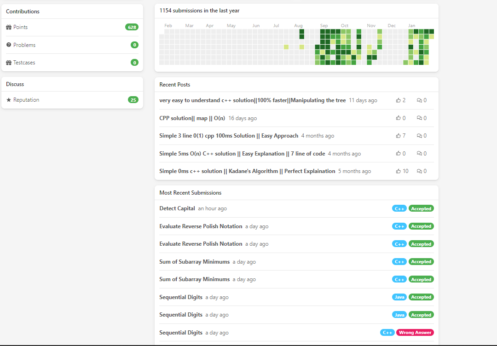
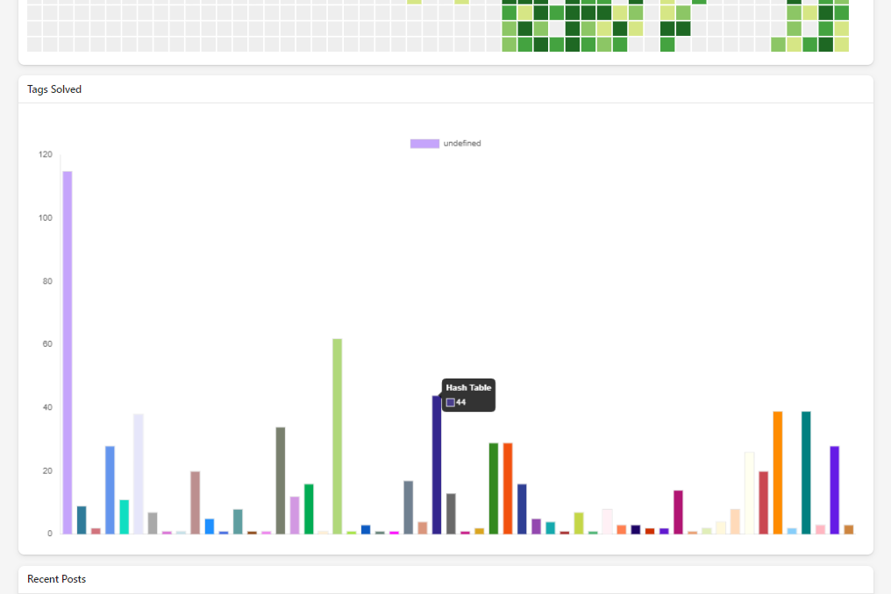

# What is this?

This is a Chrome Extension which Add a graph on leetcode page for visualizing different number of question tag in the form of bar graph the basis of number of problem solve by user on specific question tag

# Installation

 link:- soon releasing on https://chrome.google.com/webstore/category/extensions?hl=en

# Without Leetcode Analyzer

# With Leetcode Analyzer

